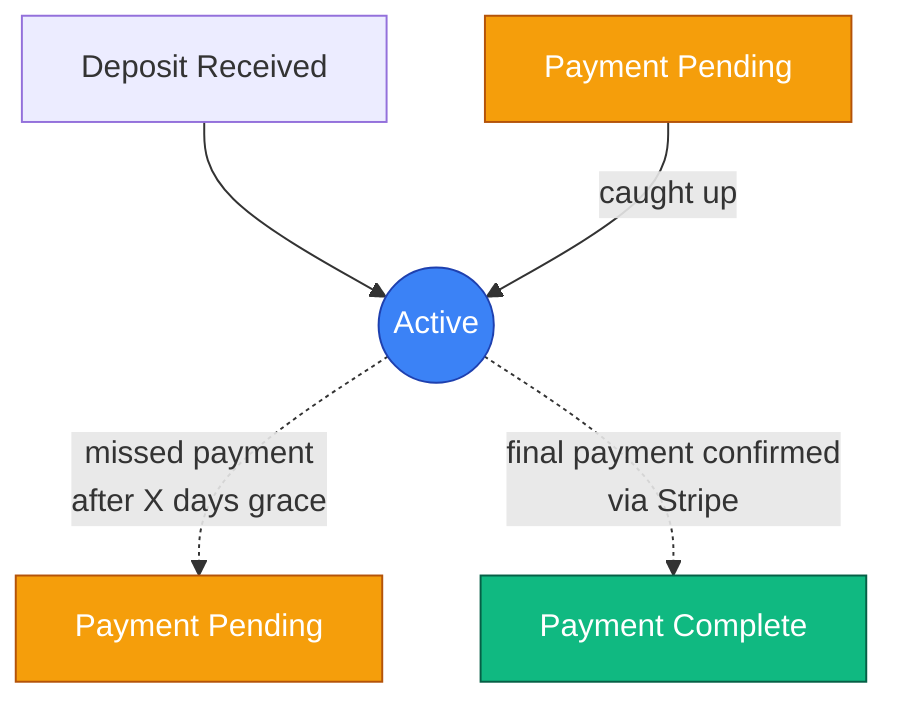
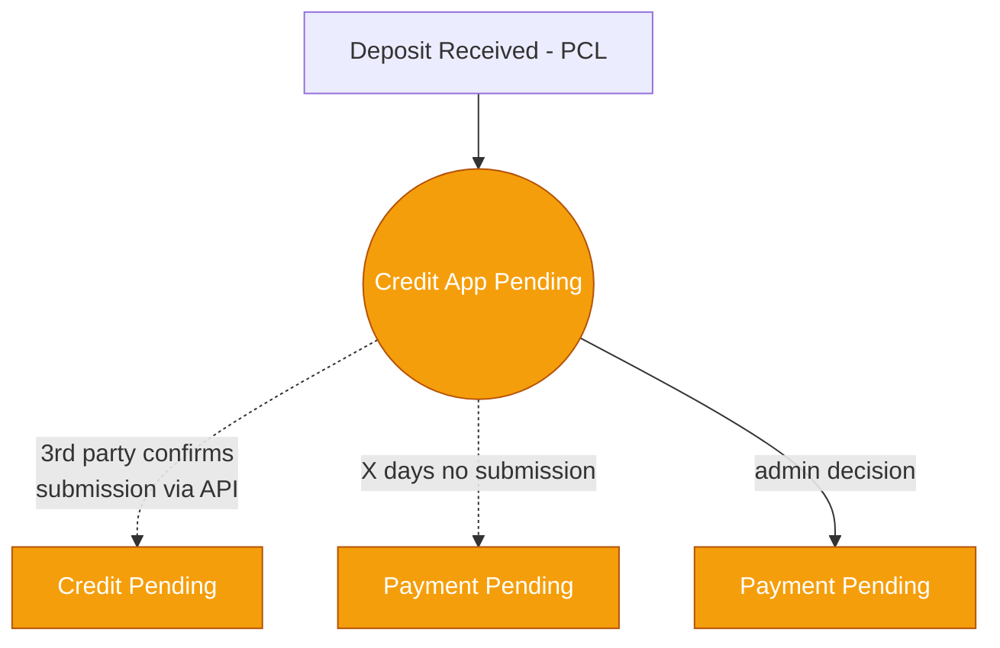
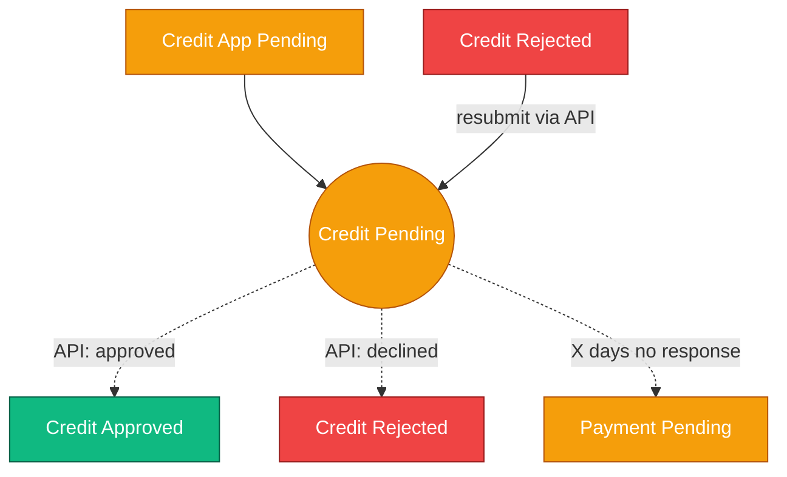
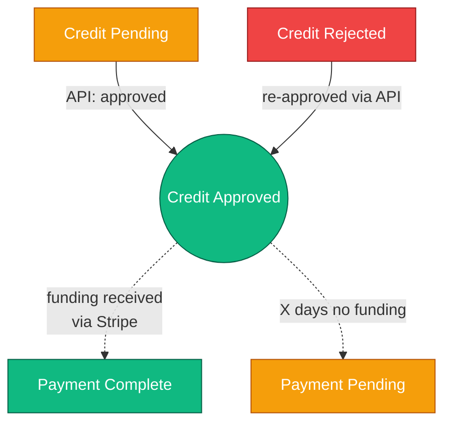
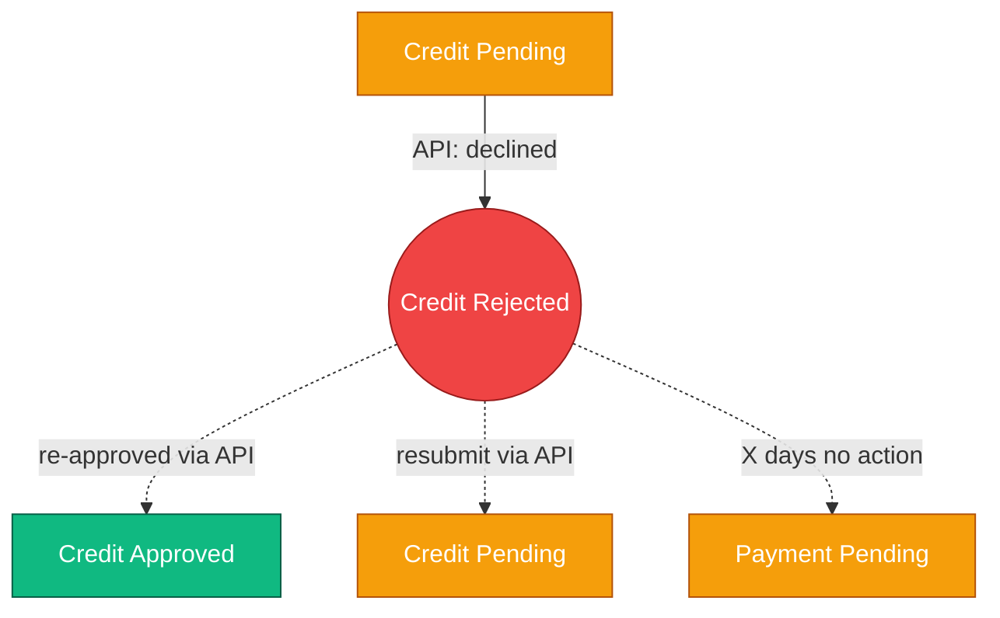
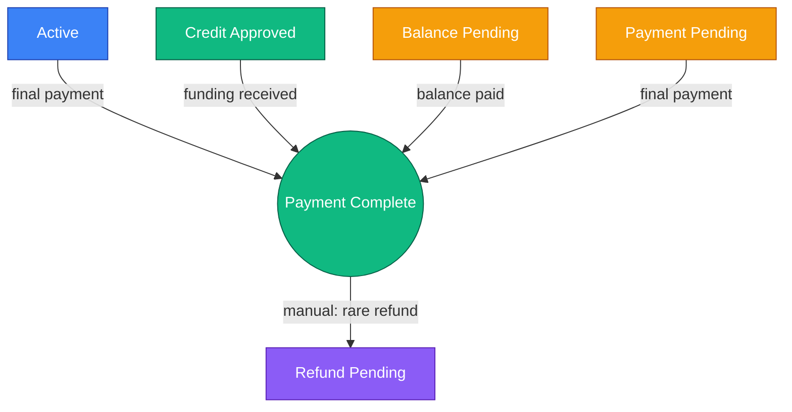
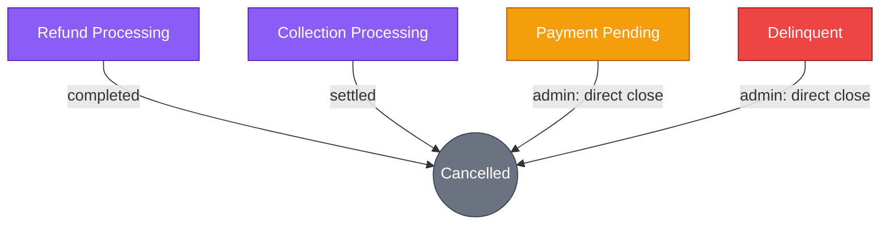

# Automated Finance State Rules

Created by: Cursor Epic Standardizer
Domain: Finance
Last edited by: Cursor Epic Standardizer
Last updated time: February 13, 2026 7:03 PM
Created time: February 13, 2026 3:38 PM
Status: In Progress

<aside>
⚙️ This document defines system-automated finance states — states managed by schedulers, payment gateway events, and third-party API callbacks. Use the [**Finance State Machine**](https://www.notion.so/Finance-State-Machine-2f25724f368b80b19083e27ea4adb9b5?pvs=21) page for the full state diagram and access level definitions. For states requiring manual human action, see [***Manual Finance Work Items***](https://www.notion.so/Manual-Finance-Work-Items-3065724f368b817daecbe5dbe48152e6?pvs=21).

</aside>

# Overview

The finance system includes 7 states that operate through automated rules. These states are driven by payment gateway events (Stripe), third-party lending API callbacks, and internal schedulers/cron jobs. Each state below specifies its trigger, what the system does automatically, what exits are available, and which business rule parameters (configurable timeouts) need to be set.

1. **Active** — monitors payment schedule, detects missed or final payments
2. **Credit_Application_Pending** — awaits 3rd party confirmation that application was submitted
3. **Credit_Pending** — awaits 3rd party API decision (approved/declined)
4. **Credit_Approved** — awaits lump sum funding from the loan company
5. **Credit_Rejected** — listens for re-approval or resubmission; timeout fallback
6. **Payment_Complete** — terminal success; closes payment tracking
7. **Cancelled** — terminal end; cleanup, deactivation, and schedule cancellation

## Quick Reference

```
#   State                        Access        Trigger Source              Timeout Rule
─   ────────────────────────────   ────────────   ─────────────────────────   ─────────────────────────
1   Active (FIN-01)               Full          Deposit received            X days grace → Pmt_Pending
2   Credit_App_Pending (FIN-11)   Full          Deposit (PCL path)          X days → Pmt_Pending
3   Credit_Pending (FIN-13)       Full          3rd party confirms sub      X days no response → Pmt_Pending
4   Credit_Approved (FIN-14)      Full          3rd party API approved      X days no funding → Pmt_Pending
5   Credit_Rejected (FIN-08)      Full          3rd party API declined      X days no action → Pmt_Pending
6   Payment_Complete (FIN-05)     Partial Back  Final payment confirmed     None (terminal)
7   Cancelled (FIN-07)            Partial Back  From processing states      None (terminal)
```

## How to Use This Document

- Each state section includes: Description, Trigger, System Behavior, Automated Exits, Business Rule Parameters, and Dev Notes.
- Timeout values are marked as **`X days`** — these are placeholders that must be configured before go-live. See the **Business Rule Parameters** section at the end of this page.
- Some states also appear on the ***Manual Finance Work Items*** page where they require human action (e.g., Payment_Complete → Refund_Pending is a manual decision).
- Dev Notes are intended for the engineering team and provide implementation guidance, not specifications.

---

# Automated State Definitions

## 1. Active (FIN-01)

<aside>
✅ **Owner:** System  |  **Access:** Full  |  **Applies to:** All payment methods (AT Installment, Direct Debit)

</aside>

### Description

Entry state after deposit is received. The student's account is in good standing with all payments on schedule. The system monitors the payment schedule and detects either missed payments (triggering a transition to Payment_Pending) or final payment confirmation (completing the payment journey). Students retain full platform access while in this state.

### Flow Diagram



### Trigger

Deposit received and confirmed via payment gateway (Stripe). Applies to both AT Installment and Direct Debit paths. Also re-entered from Payment_Pending when the student catches up on overdue payments.

### System Behavior

- Monitors scheduled payment dates against the student's payment plan
- Checks payment gateway (Stripe) for successful payment events via webhooks
- If a scheduled payment is not received within **X days** (grace period), auto-transitions to Payment_Pending
- If the final scheduled payment is confirmed via Stripe, auto-transitions to Payment_Complete

### Automated Exits

- **→ Payment_Pending:** Scheduled payment missed (not received within X days grace period)
- **→ Payment_Complete:** Final payment confirmed via payment gateway

### Business Rule

<aside>
⏰ **BRP-01:** Grace period before missed payment triggers Payment_Pending = **`X days`** (to be configured)

</aside>

### Dev Notes

<aside>
🛠️ Implement a scheduler/cron that checks payment due dates daily. Compare due date + grace period against current date. Listen for Stripe webhook events for payment success/failure. The “final payment” detection should verify that total paid equals total owed on the payment plan.

</aside>

---

## 2. Credit_Application_Pending (FIN-11)

<aside>
📝 **Owner:** System  |  **Access:** Full  |  **Applies to:** Premium Credit

</aside>

### Description

Entry state for the Premium Credit (third-party lending) path after the deposit is paid. The student needs to submit their credit application on the 3rd party’s platform. The system waits for confirmation from the 3rd party API that the application has been submitted. If no submission is confirmed within the configured timeout, the system automatically moves the student to Payment_Pending. The 3rd party API integration is referenced at a high level — the engineering team will map the specific endpoints during discovery.

### Flow Diagram



### Trigger

Deposit received and confirmed on the Premium Credit path. The student is directed to the 3rd party lending platform to begin their credit application.

### System Behavior

- Awaits notification from 3rd party API that the credit application has been submitted
- If no submission is confirmed within **X days**, auto-transitions to Payment_Pending
- Student retains full platform access during this period

### Automated Exits

- **→ Credit_Pending:** 3rd party API confirms application has been submitted
- **→ Payment_Pending:** No submission after X days (automated timeout) OR admin decision (manual)

### Business Rule

<aside>
⏰ **BRP-02:** Application submission timeout = **`X days`** (to be configured)

</aside>

### Dev Notes

<aside>
🛠️ Listen for 3rd party API webhook/callback for “application submitted” event. Implement a scheduler that checks timeout against state entry date. The admin can also manually move to Payment_Pending at any time (see Manual Finance Work Items). Specific API endpoint mapping to be done during engineering discovery.

</aside>

---

## 3. Credit_Pending (FIN-13)

<aside>
⏳ **Owner:** System  |  **Access:** Full  |  **Applies to:** Premium Credit

</aside>

### Description

The credit application has been submitted to the 3rd party lender and is under review. The system awaits the lender’s decision via their API — the outcome will be either approval (Credit_Approved) or decline (Credit_Rejected). If the 3rd party does not respond within the configured timeout, the system falls back to Payment_Pending. Students retain full access during the review period.

### Flow Diagram



### Trigger

3rd party API confirms that the credit application has been submitted (from Credit_Application_Pending). Also re-entered from Credit_Rejected if the student resubmits via the 3rd party platform.

### System Behavior

- Awaits decision from 3rd party API (approved or declined) via webhook/callback
- If no decision is received within **X days**, auto-transitions to Payment_Pending
- Student retains full platform access during the review period

### Automated Exits

- **→ Credit_Approved:** 3rd party API returns “approved”
- **→ Credit_Rejected:** 3rd party API returns “declined”
- **→ Payment_Pending:** No API response after X days (automated timeout) OR self-pay/admin decision (manual)

### Business Rule

<aside>
⏰ **BRP-03:** API response timeout = **`X days`** (to be configured)

</aside>

### Dev Notes

<aside>
🛠️ Listen for 3rd party API webhook/callback for decision events (approved/declined). Implement timeout scheduler against state entry date. The admin or student can also manually trigger self-pay path to Payment_Pending. Specific API endpoint mapping to be done during engineering discovery.

</aside>

---

## 4. Credit_Approved (FIN-14)

<aside>
✅ **Owner:** System  |  **Access:** Full  |  **Applies to:** Premium Credit

</aside>

### Description

The 3rd party lender has approved the credit application. The system now awaits a one-time lump sum funding payment from the loan company. Once the funding is received and confirmed via Stripe, the student’s financial obligation to Access Training is fulfilled — any remaining loan repayments are strictly between the student and the 3rd party lender. If funding is not received within the configured timeout, the system moves the student to Payment_Pending. Note: if a refund is ever issued post-completion, it applies only to the deposit paid by the student (not the loan amount).

### Flow Diagram



### Trigger

3rd party API returns “approved” (from Credit_Pending). Can also be re-entered if a previously rejected application is later approved by the 3rd party.

### System Behavior

- Monitors payment gateway (Stripe) for incoming lump sum from the loan company
- If funding is received, confirms amount matches expected and auto-transitions to Payment_Complete
- If funding is not received within **X days**, auto-transitions to Payment_Pending
- Student retains full platform access during this period

### Automated Exits

- **→ Payment_Complete:** Lump sum funding received and confirmed via Stripe
- **→ Payment_Pending:** Funding not received after X days (automated timeout)

### Business Rule

<aside>
⏰ **BRP-04:** Funding receipt timeout = **`X days`** (to be configured)

</aside>

### Dev Notes

<aside>
🛠️ Listen for Stripe webhook for incoming payment matching the expected loan amount. Implement timeout scheduler against state entry date. When transitioning to Payment_Complete, the student’s relationship with the 3rd party lender is outside our scope. If later refunded, only the deposit portion applies.

</aside>

---

## 5. Credit_Rejected (FIN-08)

<aside>
❌ **Owner:** System  |  **Access:** Full  |  **Applies to:** Premium Credit

</aside>

### Description

The 3rd party lender has declined the credit application. The system continues listening to the 3rd party API for a potential re-approval or resubmission — there is no limit on resubmissions as long as the 3rd party allows it. However, if no API activity is detected within the configured timeout, the system stops listening and automatically moves the student to Payment_Pending. At that point, the admin decides next steps (self-pay, refund, collection, or cancellation). Students retain full access while the system is still listening.

### Flow Diagram



### Trigger

3rd party API returns “declined” (from Credit_Pending).

### System Behavior

- Continues listening to 3rd party API for re-approval or resubmission events
- Student may appeal or resubmit directly on the 3rd party’s platform (unlimited attempts as long as 3rd party allows)
- If no API activity within **X days**, system stops listening and auto-transitions to Payment_Pending
- Student retains full platform access while system is actively listening

### Automated Exits

- **→ Credit_Approved:** 3rd party API returns re-approval
- **→ Credit_Pending:** 3rd party API confirms resubmission of a new application
- **→ Payment_Pending:** No API activity after X days (automated timeout — system stops listening to 3rd party)

### Business Rule

<aside>
⏰ **BRP-05:** Inactivity timeout / stop listening = **`X days`** (to be configured — measured from state entry date OR last API event, TBD)

</aside>

### Dev Notes

<aside>
🛠️ Continue listening to 3rd party API webhooks while in this state. Implement a timeout scheduler — business to decide whether timeout is measured from state entry date or last API event date. Once timeout triggers and state moves to Payment_Pending, deregister/stop processing 3rd party webhooks for this student’s finance record.

</aside>

---

## 6. Payment_Complete (FIN-05)

<aside>
🏆 **Owner:** System  |  **Access:** Partial Back  |  **Applies to:** All payment methods

</aside>

### Description

All financial obligations to Access Training have been fulfilled. The system closes active payment tracking and updates the student’s access level to Partial Back (can’t make new bookings but retains access to previous materials and digital repo). This is a terminal success state — no further automated transitions occur. The only possible exit is to Refund_Pending, which is always a manual decision by the finance team. Any post-completion activities (certificates, reporting) are handled in separate processes outside this document.

### Flow Diagram



### Trigger

Final payment confirmed via payment gateway (Stripe). Can be entered from Active (last installment paid), Credit_Approved (lump sum funding received), Balance_Pending (full balance paid), or Payment_Pending (final overdue payment made).

### System Behavior

- Closes active payment tracking/schedule for the student
- Updates student access level to Partial Back (no new bookings, retains previous materials + digital repo)
- Finance record marked as complete
- No further automated monitoring or transitions

### Automated Exits

<aside>
🛑 None. This is a terminal state. The only exit is **Refund_Pending**, which is always a manual decision (see Manual Finance Work Items).

</aside>

### Business Rule

*None — terminal state with no automated timeout.*

### Dev Notes

<aside>
🛠️ On entry, ensure all payment schedules are marked complete. Update the student’s access level in the access control system to Partial Back. This state should be idempotent — entering it multiple times should not cause issues. Verify total paid equals total owed before transitioning.

</aside>

---

## 7. Cancelled (FIN-07)

<aside>
🚫 **Owner:** System  |  **Access:** Partial Back  |  **Applies to:** All payment methods

</aside>

### Description

The student’s finance account is permanently terminated. Upon entry, the system performs automated cleanup: cancels any future scheduled payments or active Stripe subscriptions, and updates the student state machine to “deactivated.” This is the final terminal state — no further transitions are possible. The cancellation reason, financial details (refund/collection amounts, reference codes), and notes were all captured in upstream states before reaching Cancelled.

### Flow Diagram



### Trigger

Entry from Refund_Processing (refund completed), Collection_Processing (collection settled or unsettled), Payment_Pending (admin decision for direct close with $0 balance), or Delinquent (admin decision for direct close). Cancellation reason must already be captured upstream.

### System Behavior

- Cancels any future scheduled payments or active Stripe subscriptions via Stripe API
- Updates the student state machine to “deactivated” status
- Updates student access level to Partial Back
- Finance record permanently closed — no further transitions possible

### Automated Exits

<aside>
🛑 None. This is the final terminal state. No further transitions are possible.

</aside>

### Business Rule

*None — terminal state with no automated timeout.*

### Dev Notes

<aside>
🛠️ On entry, call Stripe API to cancel any active subscriptions or scheduled payments. Update the student lifecycle/state machine to “deactivated.” Ensure this is idempotent. Cancellation reason and financial details should already be present from upstream states — do not require them again at this point.

</aside>

---

# Business Rule Parameters

<aside>
⚠️ The following timeout values must be configured before go-live. Each rule is referenced in its respective state section above. Update the **VALUE** column once the business has decided on the duration.

</aside>

```
RULE     STATE                        PARAMETER                       VALUE     NOTES
─────    ──────────────────────────  ─────────────────────────────  ───────  ────────────────────────────
BRP-01   Active                       Missed payment grace period     X days    After due date, before → Pmt_Pending
BRP-02   Credit_App_Pending           Submission timeout              X days    No submission → Pmt_Pending
BRP-03   Credit_Pending               API response timeout            X days    No 3rd party decision → Pmt_Pending
BRP-04   Credit_Approved              Funding receipt timeout         X days    No funding received → Pmt_Pending
BRP-05   Credit_Rejected              Inactivity timeout              X days    No API activity → Pmt_Pending
                                                                                (stops listening to 3rd party)
BRP-06   Payment_Pending              Delinquent trigger              X days    Overdue threshold → Delinquent
                                                                                (also on Manual Finance Work Items)
```

---

# Version Notes

**Document Version:** 1.1 (Cross-page formatting cleanup and structural consistency)

**Changes:**

- v1.0 — Created Automated Finance State Rules page with all 7 automated states (Active, Credit_Application_Pending, Credit_Pending, Credit_Approved, Credit_Rejected, Payment_Complete, Cancelled)
- Includes: Quick Reference table, Mermaid flow diagrams per state, system behavior descriptions, automated exits, dev notes, and Business Rule Parameters (BRP-01 through BRP-06)
- All timeout values marked as X days — to be configured by business before go-live
- Cross-references Manual Finance Work Items page where states have both automated and manual components
- v1.1 — Standardized all H1 heading colors to gray_background for consistency with Finance State Machine and Manual pages. Added dividers between all 7 state sections for visual separation.