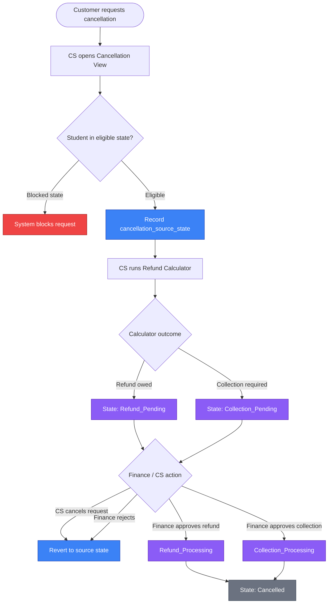
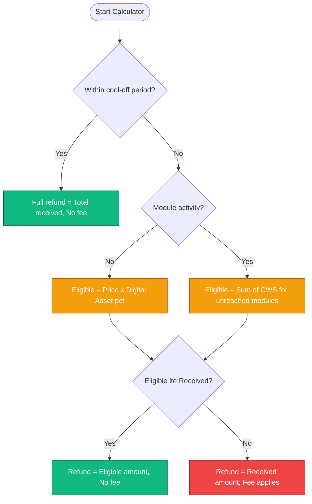

# Cancellations and Refund

Created by: Hossein EM
Domain: Finance
Last edited by: Hossein EM
Last updated time: February 13, 2026 7:22 PM
Created time: December 4, 2025 8:38 PM
 Ideas, Concerns & Questions: @Ashkan Keyhanian @Roya Davoodzade updated the refund and cancellation flow. tried to created a UX part for better understanding, but easier to go over it in the next call. 
Person: Hossein EM
Status: Signed Off

## 1. Overview and Business Rules

### **1. Purpose**

### **Overview**

This epic defines the end-to-end **cancellation, refund, and fee collection capability** across student, customer service, and finance operations. Its purpose is to provide a consistent, auditable, and policy-driven way to handle student cancellations while protecting revenue, ensuring operational clarity, and avoiding hard-coded business logic.

### **Scope**

The epic covers:

- Student-initiated or CS-initiated cancellation requests
- Refund eligibility determination
- Refund execution or cancellation fee collection
- Clear separation of responsibilities between Customer Service and Finance
- State-driven access and capability management

### **Operating Model**

At a high level:

- **Customer Service** initiates and evaluates cancellation requests using a standardized refund calculator.
- **Finance** approves and executes all monetary actions (refunds or collections).
- **System state machines** govern student access, finance work items, and lifecycle transitions rather than embedding logic directly into workflows or UI behavior.

### **Design Principles**

- Manual-first, observable behavior to allow learning before automation
- Deterministic refund outcomes driven by configuration, not judgment
- Explicit approval boundaries and audibility
- Forward-compatible design that allows policy evolution without structural rewrites

This section serves as the executive and stakeholder summary for how cancellation and refund scenarios are handled across the platform.

---

# 2. Operational Workflow

This section describes the **end-to-end operational flow** for cancellation, refund, and fee collection, as visualized in the attached Miro diagram. The diagram is the authoritative reference for sequencing; this section provides narrative clarity on each step and ownership boundary.

[https://miro.com/app/board/uXjVJi1qzXk=/?moveToWidget=3458764650547402480&cot=14](https://miro.com/app/board/uXjVJi1qzXk=/?moveToWidget=3458764650547402480&cot=14)

**Operational Workflow Diagram (Mermaid)**

---

### **2.1 Request Initiation**

- A cancellation request is initiated via **Customer Service** (call, email, or internal request).
- The CS agent opens the student record and enters the **Cancellation View**.
- The CS agent selects a **cancellation reason** from the dropdown (see ***Cancellation Reasons*** page for the full list of codes CR01–CR06). Exactly one reason must be selected. If "Other" is chosen, a free-text note is mandatory.
- No financial action is taken at this stage.

<aside>
🚫 **BLOCKING RULE**: Students in the following states **cannot** initiate new cancellation requests: Collection_Pending, Collection_Processing, Refund_Pending, Refund_Processing, and Cancelled. These states indicate an active or completed finance process.

**Eligible states** for cancellation requests: Active, Payment_Complete, Payment_Pending, Delinquent, Balance_Pending, Credit_Application_Pending, Credit_Pending, Credit_Approved, and Credit_Rejected.

</aside>

---

### **2.2 Refund Calculator Evaluation**

- CS runs the **Refund Calculator (explained in section 3)**, which evaluates:
    - Cool-off eligibility
    - Module activity
    - Digital asset entitlement
    - Cost-we-save calculation
    - Total amount received
- The calculator produces a **deterministic outcome**:
    - Eligible refund amount (if any)
    - Or a cancellation-fee-only outcome
- CS may adjust the cancellation fee (if applicable) and must provide a reason for any adjustment.

---

### **2.3 Submission to Finance**

- CS submits the cancellation/refund request.
- Submission triggers:
    - Creation of a **Finance work item**
    - Transition of the **Finance State Machine** to a pending state (e.g. Refund Pending or Collection Pending)
- CS cannot execute or approve any monetary action.

**⚠️ Cancellation Reason Required**: All transitions to Refund_Pending, Collection_Pending, or Cancelled must include a Cancellation Reason. This is mandatory for audit trail integrity and is enforced at the system level.

---

### **2.4 Finance Review and Decision**

- Finance reviews the submitted case via the **Finance View dashboard**.
- Finance validates:
    - Calculator output
    - Amount received
    - Payment method
    - Override requests (if any)
- Finance either:
    - Approves and executes a refund, or
    - Initiates cancellation fee collection, or
    - Rejects the request with feedback

---

### **2.5 Execution by Payment Method**

- Refunds and collections are executed manually by Finance using the appropriate channel:
    - Stripe
    - Premium Credit
    - Bank transfer / direct debit
- The system records the execution and updates the Finance State Machine accordingly.

<aside>
💡

**Collection Settlement**: When processing a collection, the flow is Collection_Pending → Collection_Processing → Cancelled. The system must capture:

- `settlement_status`: enum (settled | unsettled | n/a) - ⚠️ **IMPLEMENTATION NOTE**: This field must be implemented in Phase 1
- `settlement_amount`: number - The amount paid as part of the settlement (if applicable)
</aside>

---

### **2.6 State Transitions and Closure**

- Completion of finance actions triggers:
    - Final Finance state transition (e.g. Refunded, Collected, Closed)
    - Corresponding Student state transitions via the Student State Machine
- Access and capabilities are updated dynamically based on state.

**Refund_Pending Access Control**: Students in Refund_Pending state have **Partial Back** access (as defined in the Finance State Machine). They retain access to:

- Completed modules they have already accessed
- Digital libraries/repositories
- Previously accessed materials

Access is blocked for:

- New modules not yet accessed
- Assessments
- Certification
- CS is notified of completion and communicates outcome to the student.

---

### **2.7 Rejection Path**

- If a request is rejected:
    - Finance adds comments and reason
    - No financial execution occurs
    - CS is notified for follow-up
    - States remain unchanged

---

### 2.8 Refund Reversal

A cancellation request can be reversed before Finance completes the refund or collection. The system tracks the student’s original state via a `cancellation_source_state` field, which records the finance state the student was in when the cancellation request was initiated. Reversal can occur in two scenarios:

- **CS-initiated cancellation**: CS can cancel their own cancellation request before Finance begins review. The student automatically reverts to their `cancellation_source_state`. No Finance approval is required for this reversal.
- **Finance-initiated rejection**: Finance reviews the cancellation request and rejects it. The student automatically reverts to their `cancellation_source_state`.
- In both cases, the system reads the stored `cancellation_source_state` and restores the student to that exact finance state (e.g., Active, Payment_Complete, Credit_Approved, Balance_Pending, etc.). Access and capabilities are restored to match the returned state.
- A reversal or rejection reason must be provided and recorded for audit purposes
- The reversal creates a notification for the CS agent to follow up with the student

<aside>
💡

### **Key Notes**

- All monetary actions are Finance-owned.
- State machines are the only mechanism controlling access and student access changes.
- The workflow is intentionally manual-first to support learning and governance before automation.
</aside>

---

# 3. Refund Calculator

This section defines the **refund calculator** that determines whether a student is eligible for a refund, the refund amount (if any), or whether the case results in a cancellation fee only. The calculator is **policy-driven, deterministic, and configuration-based**, and its output directly drives the operational workflow described in the previous section.

---

### **3.1 Core Principles**

- The calculator produces a **single, authoritative outcome** per cancellation request.
- It does **not** execute money movement.
- All outputs are **capped by the total amount received**.
- Cancellation fee logic is **exception-based**, not a default deduction.
- Inputs are configuration-driven (global or course-package-level).

---

### **3.2 Inputs**

The calculator evaluates the following inputs:

- Course package price
- Total amount received to date
- Cool-off period eligibility
- Module activity status
- Digital Asset percentage (per course package)
- Cost We Save per module (per course package)
- Cancellation fee amount (default £250, manually adjustable by CS with reason)

**⚠️ Note for credit state students**: For students in credit states (Credit_Application_Pending, Credit_Pending, Credit_Approved, Credit_Rejected), "Total amount received to date" refers *only* to amounts paid directly by the student (e.g., deposit). Third-party payments (e.g., Premium Credit lump sum) are excluded from refund calculations.

---

### **3.3 Cool-off Period Rule**

- If the student is **within the cool-off period**:
    - Eligible Refund = 100% of course package price
    - Refund amount is capped by total amount received
- No cancellation fee applies
- Calculator exits after this step

---

### **3.4 No Module Activity (Outside Cool-off)**

- If the student is **outside the cool-off period** and **no module activity has occurred**:
    - Student is entitled to the **Digital Asset value**
    - Digital Asset is defined as a **percentage of the total course package**
    - The eligible refund is:

Eligible Refund = Course Package Price × Digital Asset %
    ◦ Final refund is capped by total amount received

### **3.5 Definition of Module Activity**

- Module activity is defined as **entering any registered module (even if not doing in the module)**
- Completion, attendance, or progress level is irrelevant
- The moment a student enters a module, the calculator switches to module-based logic

---

### **3.6 Module Activity Present – Cost We Save Logic**

- When module activity exists:
    - The calculator identifies the **last module reached**
    - All subsequent modules are considered **not delivered**
- Each undelivered module has an associated **Cost We Save**, defined during course package setup
- The eligible refund is calculated as:

Eligible Refund = Sum of Cost We Save for all modules not yet reached

### **3.7 Amount Received Cap**

- In all scenarios:

Refundable Amount = MIN(Eligible Refund, Total Amount Received)

- This ensures refunds never exceed collected funds and supports partial-payment scenarios.

---

### **3.8 Cancellation Fee Trigger (Exception Rule)**

- A cancellation fee applies **only if**:

Eligible Refund > Total Amount Received

- In this case:
    - No refund is issued
    - Student is required to pay the cancellation fee only
    - Default cancellation fee is £250 (agent-adjustable with reason)
- If:

Eligible Refund ≤ Total Amount Received

- Refund proceeds with amount recommendation
- No cancellation fee applies

### **3.9 Outputs**

The calculator outputs:

- Refund amount (if applicable)
- Cancellation fee amount (if applicable)
- These outputs are stored and passed to the agent to make a decision

Flow View

[https://miro.com/app/board/uXjVJi1qzXk=/?moveToWidget=3458764650549712681&cot=14](https://miro.com/app/board/uXjVJi1qzXk=/?moveToWidget=3458764650549712681&cot=14)

**Refund Calculator Flow Diagram (Mermaid)**

# 4. Agent Cancellation View

This section describes the **Customer Service agent-facing cancellation view**. The purpose of this view is to give agents full transparency into the student’s status, financial position, and refund outcome **before** any request is submitted to Finance.

This view is designed to be **informational, guided, and constrained**, ensuring consistent decisions and auditability.

---

### **4.1 Student Context & Progress Visibility**

When opening the cancellation view, the agent can clearly see:

- Student identity and current status
- Course package and trade
- Progress through the course:
    - Registered modules
    - Modules entered (module activity indicator)
    - Last module reached
- Student state (e.g. enrolled, cool off, assessment pending and etc.)

This ensures the agent understands **where the student is in their learning journey** before initiating cancellation.

---

### **4.2 Financial Snapshot**

The view surfaces a complete financial summary:

- Total course package price
- Total amount received to date
- Payment method(s) used
- Outstanding balance (if any)

This information is read-only for CS and forms the basis for refund eligibility.

---

### **4.3 Refund Calculator Output**

The refund calculator is embedded or surfaced inline and displays:

- Which calculation path was triggered:
    - Cool-off
    - No activity / digital asset
    - Module activity / cost-we-save
- Eligible refund amount (if any)
- Cancellation fee outcome (if applicable)
- Explicit indication when **no refund is possible**

The agent does not manually calculate outcomes; they review and validate the system result.

---

### **4.4 Agent Actions & Overrides**

CS agents can:

- Submit the cancellation request to Finance
- Adjust the cancellation fee **only when applicable**
- Provide a mandatory reason/comment when:
    - Adjusting the cancellation fee
    - Submitting edge cases

CS agents **cannot**:

- Execute refunds
- Approve refunds
- Override finance states

---

### **4.5 Submission and Next Steps**

Upon submission:

- A Finance work item is created
- Finance state transitions to a pending state
- Student and Finance state machines take control of access and lifecycle changes
- The agent receives confirmation that the case is under Finance review

This view ensures CS can confidently manage cancellation requests without overstepping financial authority.

# 5. Finance View

This section describes the **Finance-facing experience**, which is centered around a **work-item driven dashboard**. The goal is to give Finance clear visibility into pending actions, enforce approval ownership, and support timely execution of refunds and collections.

---

### **5.1 Finance Dashboard (Work Queues)**

The Finance landing view is a dashboard composed of **work item lists**, segmented by Finance state and urgency.

**Core work item categories include:**

- Refund Pending
- Collection Pending
- Completed / Cancelled (terminal state — reached via Refund_Processing or Collection_Processing)

**Filtering and search capabilities:**

- Payment method (Stripe, Premium Credit, Bank Transfer, etc.)
- LastUpdated date
- Course package
- Trade
- Student name / identifier
- Submitted by (CS agent)

**Aging and SLA visibility:**

- Work items are grouped by time since submission:
    - < 1 day
    - 1–2 days
    - 2+ days (configurable)
- This allows Finance to prioritize overdue or high-risk cases.

---

### **5.2 Work Item List View**

Selecting a work queue opens a **tabular list of student cases**, displaying:

- Finance state (Refund Pending, Collection Pending, etc.)
- Last updated timestamp
- Student name
- Course package
- Refund or collection amount
- Payment method
- Submission date

This view is read-only and optimized for scanning and prioritization.

---

### **5.3 Case Detail View**

Clicking a specific student opens the **Finance case detail view**, where Finance can:

- Review:
    - Refund calculator output
    - Total amount received
    - Cancellation fee (if applicable)
    - CS comments and override reasons
- Validate:
    - Payment method
    - Eligibility and caps
- Execute:
    - Refunds via the appropriate payment channel
    - Cancellation fee collection actions

Finance actions update the **Finance State Machine**, which in turn drives downstream access and lifecycle changes.

---

### **5.4 Execution and State Updates**

Once Finance completes an action:

- The Finance state transitions through an intermediate processing state (Refund_Processing or Collection_Processing) before reaching the terminal state (Cancelled)
- The Student state machine updates access and capabilities accordingly
- CS is notified of the outcome for student communication
- The case becomes read-only for audit purposes

---

### **5.5 Ownership and Control Principles**

- Finance is the **sole owner** of:
    - Refund approval
    - Refund execution
    - Fee collection
    - Finance state overrides
- CS cannot modify finance outcomes once submitted
- All finance actions are logged and traceable

### **5.6 Manual Payment Execution (Stripe Dependency)**

At this stage, all financial executions are intentionally **manual and Finance-owned**. The system orchestrates states and records outcomes but does not directly move money.

### **Refund Execution via Stripe**

- When a case is approved for refund:
    - Finance admin navigates to **Stripe** directly
    - Enters the **approved refund amount** manually
    - Executes the refund in Stripe
- After execution, Finance updates the internal system with:
    - Final refunded amount
    - Execution date
    - Reference or confirmation details (as applicable)
- The Finance State Machine is then transitioned to Refund_Processing → Cancelled, which triggers downstream updates (including student access and lifecycle changes)

### **Cancellation Fee Collection via Stripe**

- When a case results in a **cancellation fee only**:
    - Finance admin creates a **Stripe invoice** for the cancellation fee amount
    - The invoice is issued to the student
    - CS is informed that payment has been requested
- Once payment is confirmed in Stripe:
    - Finance updates the internal system with:
        - Amount collected
        - Payment confirmation
        - Any manual adjustments (if applied)
    - Finance State Machine transitions to **Collected**
    - Student State Machine transitions to Deactive

### **Adjustment Handling**

- If an adjustment is required (refund correction or fee change):
    - Finance updates Stripe first
    - Then mirrors the final outcome in the internal system
- All adjustments must be logged with reason and timestamp

<aside>
💡

### **Design Note**

This manual-first approach:

- Preserves control during early phases
- Avoids premature automation
- Ensures Finance remains the single source of truth for money movement
- Allows future automation once patterns and volumes are understood
</aside>

# 6. State Machines, Access & Capability Control

This design does **not hard-code access, permissions, or lifecycle behavior**. All access and capability decisions are driven by existing **state machines**, which act as the system of record.

### **Core Concept**

- **States define capabilities**, not workflows.
- Views and processes **react to state**, they do not enforce rules themselves.
- Cancellation, refund, and collection flows only **trigger state transitions**.

### **Student State Machine ([link](https://www.notion.so/Student-State-Machine-Dropped-2b65724f368b80579802d9fb8c21683f?pvs=21))**

Purely a visibility into academic and course package journey of the student. for this case, it can be useful for agent to understand student journey (for example cool off period, assessment stage and so on) 

### **Finance State Machine ([link](https://www.notion.so/Finance-State-Machine-Dropped-and-updated-in-a-new-doc-2c75724f368b8037a43ecad01b34ba68?pvs=21))**

- Controls:
    - Refund and collection lifecycle
    - Approval and execution states
    - Finance work item visibility
    - Student access and capability limit per state
- This epic relies on the Finance State Machine to:
    - Drive Finance dashboards and queues
    - Gate execution authority
- Full definitions, transitions, and intermediate processing states (Refund_Processing, Collection_Processing) are maintained in the Finance State Machine documentation

<aside>
💡

### **Design Implication**

- Policy changes require **state changes**, not code rewrites.
- Access and capability remain **configurable, auditable, and consistent** across the platform.
</aside>

---

# 7. Overrides, Approval Controls, and Monitoring

This section defines how **manual overrides, approvals, and monitoring** are handled to ensure control, auditability, and operational visibility while keeping the system flexible in early phases.

---

### **7.1 Override Ownership and Boundaries**

- **Finance is the sole owner** of Finance state overrides.
- **Customer Service cannot override Finance states** or execute financial actions.
- CS may:
    - Adjust cancellation fee amounts where permitted
    - Submit refund or cancellation requests
- Any CS action that impacts financial outcome **must be approved by Finance**.

---

### **7.2 Approval Flow**

- All refunds and cancellation fee collections require **explicit Finance approval** before execution (through refund pending and collection pending states)
- Approval decisions are recorded with:
    - Approver identity
    - Timestamp
    - Decision outcome
    - Comments (mandatory for rejections or adjustments)

---

### **7.3 Audibility Requirements**

For every cancellation case, the system must retain:

- Original refund calculator output
- Any manual adjustments layered on top
- Actor (CS or Finance)
- Reason for override
- Timestamps for submission, approval, and execution

Calculator outputs are never overwritten; adjustments are additive and traceable.

---

**Document Version**: 2.0 (Cancellation logic alignment with Finance State Machine v7.2)

**Last Updated**: 2026-02-13

**Changes**: v2.0 — Overhauled page to align with FSM v7.2 and Manual Work Items v1.3. Key changes:

- Section 2.1: Updated blocking callout with full list of blocked and eligible states (including all 4 credit states).
- Section 2.5: Added Collection_Processing intermediate step to collection flow.
- Section 2.6: Standardized access description to use "Partial Back" referencing FSM.
- Section 2.8: Overhauled reversal logic with cancellation_source_state tracking. CS can cancel or Finance can reject, both revert to source state.
- Section 3.2: Added credit state clarification note (only direct student payments count for refund).
- Section 5.1/5.4: Fixed state names (Refund_Processing/Collection_Processing as intermediate, Cancelled as terminal).
- Section 6: Added Refund_Processing/Collection_Processing mentions in FSM reference.
- Added Mermaid diagrams for operational workflow (Section 2) and refund calculator flow (Section 3.9).
- Added cancellation reason requirement note (Section 2.3).