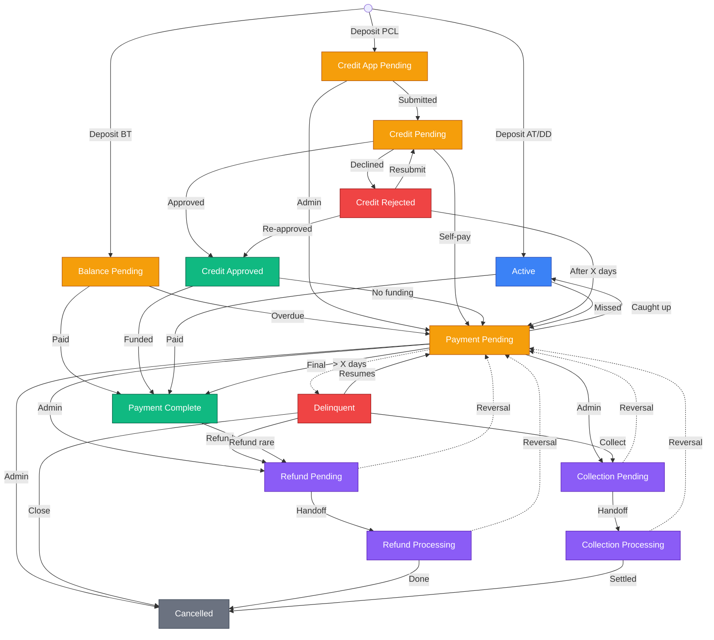
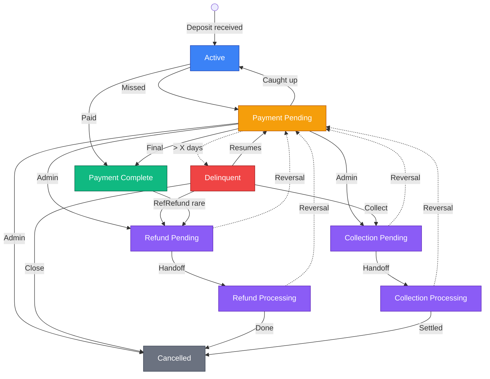
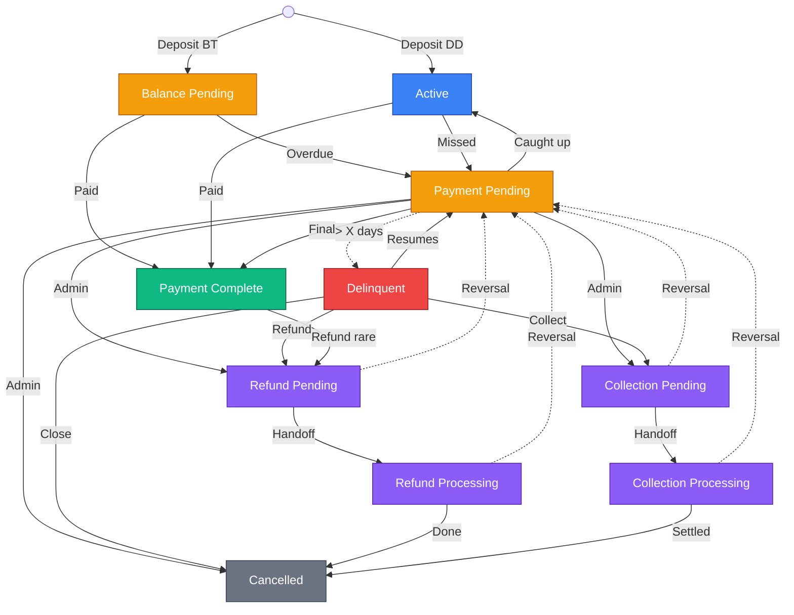
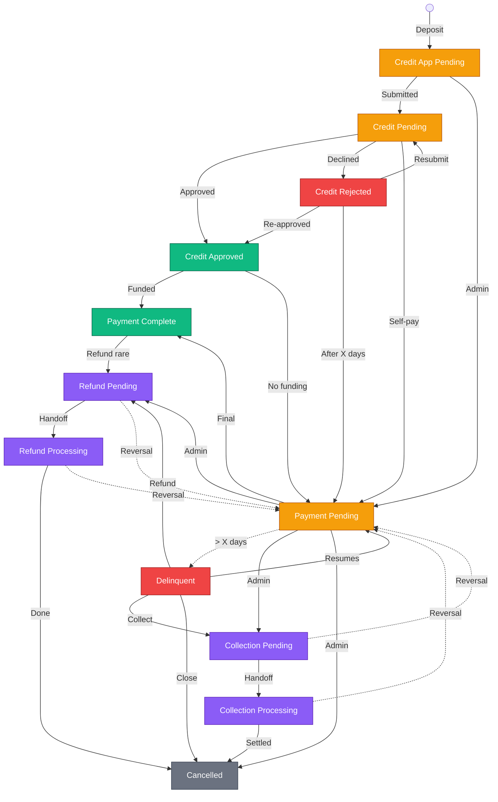

# Finance State Machine

Created by: Hossein EM
Domain: Finance
Last edited by: Hossein EM
Last updated time: February 13, 2026 7:23 PM
Created time: January 24, 2026 9:40 PM
 Ideas, Concerns & Questions: @Ashkan Keyhanian @Hossein EM @Keatyin Chin @Parsa Janbaz will clean this doc more, this is the finance state machine, but H1 and I decided to split finance and Student education Journey seperate to make it easier and avoid overlap logic. 
Person: Hossein EM
Status: Signed Off

# Background

Access Training operates multiple payment models including direct debit, internal installment plans, and third-party finance. Historically, finance status and education access were loosely coupled, leading to inconsistent access control, manual interventions, and reporting ambiguity. This document formalizes the student finance state machine and its direct impact on platform access.

<aside>
💡

this is on course package level 

</aside>

# Purpose

The purpose of this specification is to:

- Define a single source of truth for student finance states
- Explicitly control education access based on finance state
- Support automation for delinquency, collections, refunds, and completion
- Enable consistent enforcement across student portal, admin tools, and reporting

This scope applies **only to student finance states**. Lead lifecycle and CRM stages are explicitly out of scope.

This document defines:

- The Finance State Machine structure
- The meaning of each finance state
- The student access levels associated with each state
- The conceptual transitions between states

This document does not define:

- Specific business rule values (e.g. delinquency thresholds such as X days, escalation periods such as Y days)
- Communication logic per state
- Collections workflows, dunning cadence, or messaging tone
- Refund eligibility rules, amounts, or approval criteria
- Commission logic tied to finance states

All operational and configurable rules including timing thresholds, messaging, automation triggers, and financial calculations will be defined in a separate Business Rules document.

This separation is intentional to:

- Keep the state machine stable and implementation-focused
- Allow business rules to evolve without changing core system architecture
- Reduce coupling between product logic and operational policy

---

[Finance States](Finance%20States%202f25724f368b8129a5c7c052d5f5d100.csv)

# Access Levels

The following access levels define what students can do in each finance state:

## 1. Full

Complete access to all platform features. Students can make bookings, access all course materials, progress through modules, and use all digital resources.

## 2. Partial Back

No new bookings or forward progress. Students can access previously completed material and the digital repository, but cannot make future bookings or advance to new modules.

## 3. Partial

Digital repository access only. No access to previous bookings, completed modules, or future bookings. Limited to downloadable resources.

## 4. Blocked

No digital access, no past or future bookings. Students can only access billing information and support channels.

# State Machine Flows

**1) Overall Finance State Machine (All Methods)**



**2) AT Installment Plan**



**3) Direct Debit / Bank Transfer**



**4) Premium Credit / 3rd Party**



# State Definitions

<aside>
🎨 **Color Guide:** Green = Full access  |  Orange = Partial Back  |  Red = Blocked  |  Brown = Refund flow  |  Purple = Third-party credit  |  Blue = Terminal success  |  Gray = Terminal

</aside>

## Core Flow States

*Each state below is defined with **Description**, **Access Level**, **Entry From**, and **Exit To**. States are grouped by flow type. All reversals route through Payment_Pending. Refund/Collection/Cancelled can only be reached from Payment_Pending or Delinquent.*

## Active (FIN-01)

**Description**: Entry state after deposit received from Lead. Account in good standing, all payments up to date.

**Access Level**: Full.

**Entry From:** Initial (deposit from Lead), Payment_Pending (caught up).

**Exit To**:

- Payment_Pending (missed payment)
- Payment_Complete (final payment received)
- Refund_Pending (cancellation request)
- Collection_Pending (cancellation request)

## Balance_Pending (FIN-12)

**Description**: Entry state for Bank Transfer/Direct Deposit full payment after deposit. Awaiting balance payment.

**Access Level**: Full.

**Entry From**: Initial (deposit from Lead, bank transfer/direct deposit full payment).

**Exit To**:

- Payment_Complete (balance paid)
- Payment_Pending (overdue)
- Refund_Pending (cancellation request)
- Collection_Pending (cancellation request)

## Payment_Pending (FIN-02)

**Description**: Payment missed or overdue (within grace period). Not an initial state.

**Access Level**: Partial Back.

**Entry From**: Active (payment missed), Balance_Pending (overdue), Credit_Application_Pending (admin decision), Credit_Approved (funding not received after X days), Credit_Rejected (after X days), Credit_Pending (admin decision), Delinquent (resumes payments).

**Exit To**:

- Active (payment received / caught up)
- Delinquent (overdue > X days)
- Refund_Pending (admin decision)
- Collection_Pending (admin decision)
- Cancelled (admin decision)
- Payment_Complete (final payment)

## Delinquent (FIN-03)

**Description**: Payment significantly overdue (> X days). Collections warnings active. Account at risk of escalation.

**Access Level**: Blocked.

**Entry From**: Payment_Pending (threshold exceeded).

**Exit To**:

- Payment_Pending (resumes payments)
- Collection_Pending (escalation > Y days)
- Refund_Pending (refund approved)
- Cancelled (direct close, if no refund/collection needed)

## Payment_Complete (FIN-05)

**Description**: All financial obligations fulfilled. Student has fully paid for their course package. Terminal state for successful completion.

**Access Level**: Partial Back — completed-content access; upsell eligible.

**Entry From**: Active (final payment), Credit_Approved (funded), Balance_Pending (balance paid), Payment_Pending (final payment).

**Exit To**:

- Refund_Pending (rare: post-completion refund)
- Collection_Pending (cancellation request)

---

## Collection Flow States

*Collection_Pending and Collection_Processing handle the collections pipeline. Both states are managed by the Finance team.*

## Collection_Pending (FIN-04)

**Description**: Account in formal collections process.

**Access Level**: Blocked.

Entry From: Payment_Pending (admin decision), Delinquent (collection path), Active (cancellation request), Payment_Complete (cancellation request), Balance_Pending (cancellation request), Credit_Application_Pending (cancellation request), Credit_Pending (cancellation request), Credit_Approved (cancellation request), Credit_Rejected (cancellation request).

**Exit To**:

- Collection_Processing (handed off to interim team/bank)
- `cancellation_source_state` (reversal: CS cancels request or Finance rejects — student reverts to their original state)

## Collection_Processing (FIN-10)

**Description**: Collection handed off to interim team or bank; processing in progress (payment being processed and/or debt actively pursued).

**Access Level**: Blocked.

**Entry From**: Collection_Pending (handed off to interim/bank).

**Exit To**:

- Cancelled (settled with fee, or unsettled)
- Payment_Pending (reversal: collection fails, student decides to pay, or finance reverses)

**Owner**: Finance

---

## Refund Flow States

*Refund_Pending and Refund_Processing handle the refund pipeline. Both states are managed by the Finance team.*

## Refund_Pending (FIN-06)

**Description**: Refund approved, awaiting handoff to interim/bank.

**Access Level**: Partial Back.

Entry From: Payment_Pending (admin decision), Delinquent (refund path), Payment_Complete (rare: post-completion refund), Active (cancellation request), Balance_Pending (cancellation request), Credit_Application_Pending (cancellation request), Credit_Pending (cancellation request), Credit_Approved (cancellation request), Credit_Rejected (cancellation request).

**Exit To**:

- Refund_Processing (handed off to interim/bank)

- `cancellation_source_state` (reversal: CS cancels request or Finance rejects — student reverts to their original state, e.g., Active, Payment_Complete, Balance_Pending, or credit state)

## Refund_Processing (FIN-09)

**Description**: Refund handed off to interim team or bank; processing in progress (including instant refunds).

**Access Level**: Partial Back.

**Entry From**: Refund_Pending (handed off to interim/bank).

**Exit To**:

- Cancelled (refund completed)
- Payment_Pending (reversal: refund failed, rejected by finance, or student changes mind)

**Owner**: Finance

---

## Third-Party Finance States

*These states apply exclusively to the Premium Credit / third-party lending path. All third-party states have Full access level.*

## Credit_Application_Pending (FIN-11)

**Description**: Entry state for Premium Credit path after deposit. Student preparing/submitting credit application.

**Access Level**: Full.

**Entry From**: Initial (deposit from Lead, Premium Credit path).

**Exit To**:

- Credit_Pending (credit application submitted)
- Payment_Pending (admin decision)
- Refund_Pending (cancellation request)
- Collection_Pending (cancellation request)

## Credit_Pending (FIN-13)

**Description**: Third-party finance application submitted, awaiting funding.

**Access Level**: Full.

**Entry From**: Credit_Application_Pending (submitted), Credit_Rejected (resubmitted via 3rd party API).

**Exit To**:

- Credit_Approved (funding approved)
- Credit_Rejected (application declined)
- Payment_Pending (self-pay / admin decision)
- Refund_Pending (cancellation request)
- Collection_Pending (cancellation request)

## Credit_Approved (FIN-14)

**Description**: Credit/loan application approved, awaiting funding from loan company.

**Access Level**: Full.

**Entry From**: Credit_Pending (loan approved), Credit_Rejected (re-approved via 3rd party API).

**Exit To**:

- Payment_Complete (funded successfully)
- Payment_Pending (funding not received after X days)
- Refund_Pending (cancellation request)
- Collection_Pending (cancellation request)

## Credit_Rejected (FIN-08)

**Description**: Third-party finance application declined or cancelled.

**Access Level**: Full.

**Entry From**: Credit_Pending (application declined).

**Exit To**:

- Credit_Approved (re-approved via 3rd party API), Credit_Pending (resubmit via 3rd party API), Payment_Pending (after X days, automated)
- Refund_Pending (cancellation request)
- Collection_Pending (cancellation request)

---

## Terminal States

*Cancelled is the only terminal state. No further transitions are possible. Entry only from Refund_Processing, Collection_Processing, Payment_Pending, or Delinquent.*

## Cancelled (FIN-07)

**Description**: Account terminated (refunded, collected, or withdrawn).

**Access Level**: Partial Back.

**Properties**:

- `refund_issued`: boolean
- `settlement_status`: settled | unsettled — ⚠️ **IMPLEMENTATION NOTE**: Must be implemented in Phase 1 for tracking collection settlements.
- `cancellation_reason`: string

**Entry From**:

- Collection_Processing (settled/unsettled)
- Refund_Processing (refund completed)
- Payment_Pending (admin decision)
- Delinquent (direct close)

# Acceptance Criteria

<aside>
🛠️ Acceptance criteria for implementation will be defined per-sprint in Jira/Linear. This section serves as a placeholder for cross-referencing implementation progress against the state machine spec.

</aside>

# State Numbers Summary

```
FIN-01  Active                      Full          Core Flow       All
FIN-02  Payment_Pending             Partial Back  Core Flow       All
FIN-03  Delinquent                  Blocked       Core Flow       All
FIN-04  Collection_Pending          Blocked       Collection      All
FIN-05  Payment_Complete            Partial Back  Core Flow       All
FIN-06  Refund_Pending              Partial Back  Refund          All
FIN-07  Cancelled                   Partial Back  Terminal        All
FIN-08  Credit_Rejected             Full          Third-Party     Premium Credit
FIN-09  Refund_Processing           Partial Back  Refund          All
FIN-10  Collection_Processing       Blocked       Collection      All
FIN-11  Credit_Application_Pending  Full          Third-Party     Premium Credit
FIN-12  Balance_Pending             Full          Core Flow       DD / Bank Transfer
FIN-13  Credit_Pending              Full          Third-Party     Premium Credit
FIN-14  Credit_Approved             Full          Third-Party     Premium Credit

Total: 14 states  |  4 access levels  |  5 flow groups  |  2 terminal states
```

| **State #** | **State Name** | **Type** | **Entry Point?** |
| --- | --- | --- | --- |
| 1 | Active | Operational | ✅ Yes (primary) |
| 2 | Payment_Pending | Operational | ❌ No |
| 3 | Delinquent | Operational | ❌ No |
| 4 | Collection_Pending | Operational | ❌ No |
| 5 | Credit_Pending | Operational | ❌ No |
| 6 | Refund_Pending | Operational | ❌ No |
| 7 | Payment_Complete | Terminal | ❌ No |
| 8 | Cancelled | Terminal | ❌ No |
| 9 | Credit_Rejected | Operational | ❌ No |
| 10 | Collection_Processing | Interim | ❌ No |
| 11 | Refund_Processing | Interim | ❌ No |
| 12 | Credit_Application_Pending | Operational | ✅ Yes (Premium Credit) |
| 13 | Balance_Pending | Operational | ✅ Yes (Bank Transfer) |
| 14 | Credit_Approved | Operational | ❌ No |

---

# Version Notes

**Document Version**: 7.2 (Cancellation request alignment — source-state tracking and credit state eligibility)

**Last Updated**: 2026-02-13

**Changes**: v7.0 — Cross-checked with Manual Finance Work Items page and resolved all logic mismatches. Fixed: Active entry (removed incorrect Delinquent direct entry), Refund_Pending exits (all reversals now route to Payment_Pending only), Refund_Processing reversal (now routes to Payment_Pending instead of Refund_Pending), added Payment_Pending reversal exits to Collection_Pending and Collection_Processing, removed legacy/incorrect Cancelled entry points (Refund_Pending, Collection_Pending, Credit_Application_Pending). Updated all 4 Mermaid diagrams with reversal paths. Added FIN numbers and color coding to all state headings. Added color legend. Cleaned up empty callout blocks.

v7.1 — Added intro callout with cross-references to Manual Finance Work Items and Automated Finance State Rules pages. Standardized "State Numbers Summary" H1 heading color to match page convention. Added "Version Notes" heading.

v7.2 — Updated Refund_Pending and Collection_Pending entry points to include Active, Balance_Pending, Payment_Complete, and all 4 credit states (via cancellation request). Replaced Payment_Pending reversal exits with cancellation_source_state logic (student reverts to their original finance state when CS cancels the request or Finance rejects). Added Refund_Pending and Collection_Pending exit bullets to Active, Balance_Pending, Payment_Complete, Credit_Application_Pending, Credit_Pending, Credit_Approved, and Credit_Rejected.

<aside>
📄 This page is the source of truth for the finance state machine — all 14 states, their transitions, access levels, and flow diagrams. For operational details on states requiring manual action, see [**Manual Finance Work Items**](https://www.notion.so/Manual-Finance-Work-Items-3065724f368b817daecbe5dbe48152e6?pvs=21). For states managed by automated system rules (schedulers, Stripe webhooks, 3rd party API callbacks), see [**Automated Finance State Rules**](https://www.notion.so/Automated-Finance-State-Rules-3065724f368b8144943fdc77a626a55b?pvs=21).

</aside>