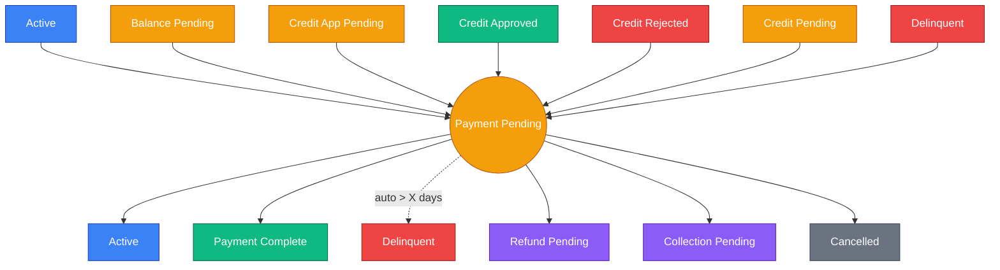
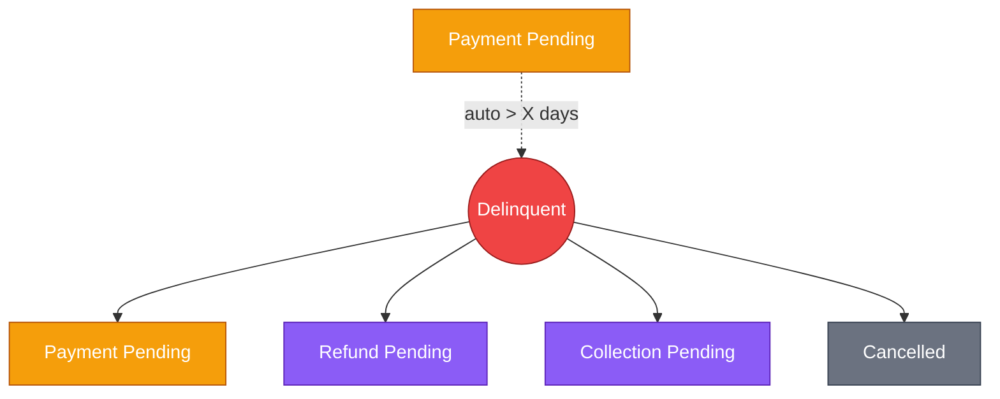
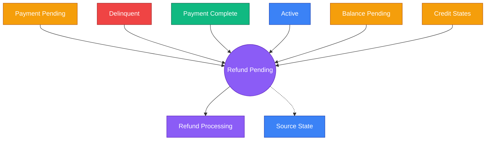
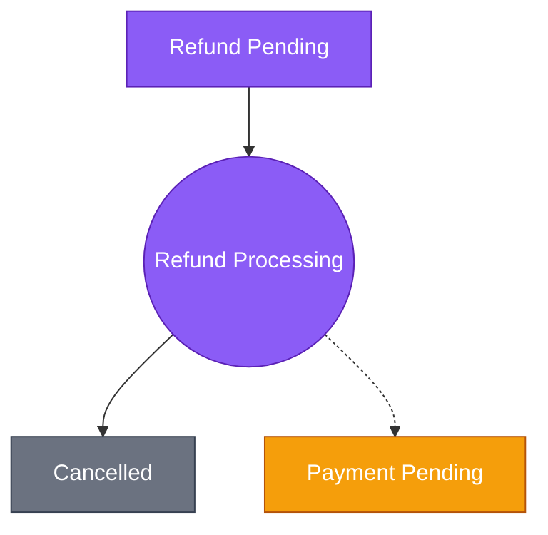
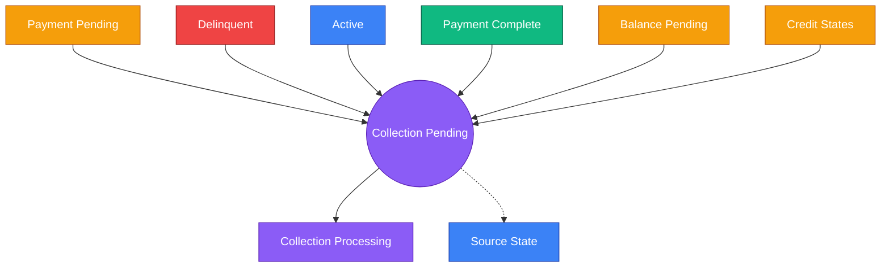
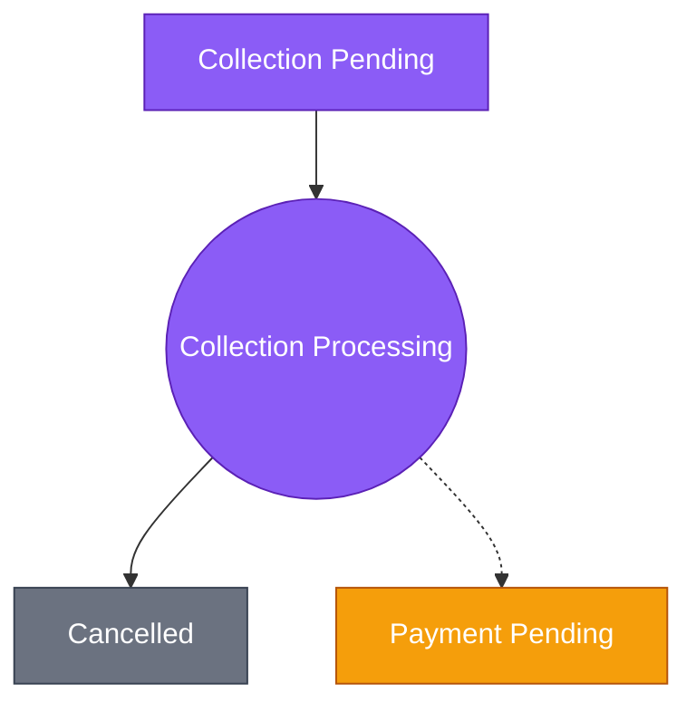
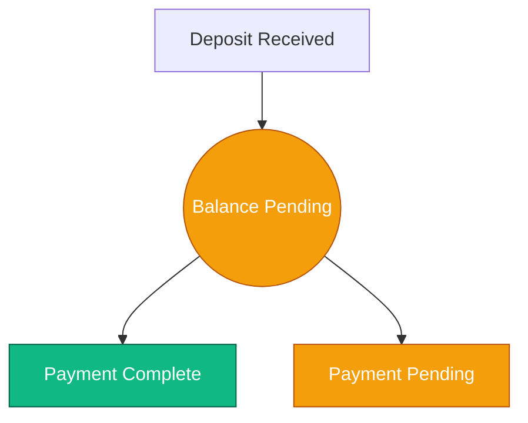

# Manual Finance Work Items

Created by: Cursor Epic Standardizer
Domain: Finance
Last edited by: Cursor Epic Standardizer
Last updated time: February 13, 2026 7:02 PM
Created time: February 13, 2026 2:58 PM
Status: In Progress

<aside>
ℹ️ This document defines every finance state that requires manual action (work item). For each work item, it specifies: what the state means, who is responsible, what transitions are available, and what fields must be populated. Use the [**Finance State Machine**](https://www.notion.so/Finance-State-Machine-2f25724f368b80b19083e27ea4adb9b5?pvs=21) page for the full state diagram and access level definitions. For states that operate through automated system rules (schedulers, API callbacks, payment gateway events), see [***Automated Finance State Rules***](https://www.notion.so/Automated-Finance-State-Rules-3065724f368b8144943fdc77a626a55b?pvs=21).

</aside>

# Overview

Finance Work Items are states in the Finance State Machine that require manual intervention by Customer Service or Finance teams. Each work item represents a point in the student's finance lifecycle where a human decision or action is needed before the student can progress to the next state.

This page covers 7 work items:

1. **Payment_Pending** — payment missed, awaiting resolution
2. **Delinquent** — significantly overdue, requires outreach
3. **Refund_Pending** — refund decided, awaiting handoff
4. **Refund_Processing** — refund in progress with interim/bank
5. **Collection_Pending** — collections decided, awaiting handoff
6. **Collection_Processing** — collections in progress with interim/bank
7. **Balance_Pending** — awaiting balance payment (bank transfer/direct deposit)

## Quick Reference

```
 #  Work Item               Owner     Access        Key Exits                        Required Fields
 ─  ───────────────────────  ────────  ────────────  ───────────────────────────────  ──────────────────────────────
 1  Payment_Pending          CS        Partial Back  Active, Complete, Delinquent†,   Cancel Reason*, Notes
                                                     Refund, Collection, Cancelled
 2  Delinquent               CS        Blocked       Pmt_Pending, Refund,             Cancel Reason*, Notes
                                                     Collection, Cancelled
 3  Refund_Pending           Finance   Partial Back  Refund_Processing, Pmt_Pending   Notes
 4  Refund_Processing        Finance   Partial Back  Cancelled, Pmt_Pending           Ref Code, Refund Amt, Notes
 5  Collection_Pending       Finance   Blocked       Collect_Proc., Pmt_Pending       Ref Code, Stripe Link, Notes
 6  Collection_Processing    Finance   Blocked       Cancelled, Pmt_Pending           Ref Code, Collect Amt, Notes
 7  Balance_Pending          Finance   Full          Pmt_Complete, Pmt_Pending        Balance Amt, Ref Code, Notes

 † = Automated transition    * = Required only for exits to Refund/Collection/Cancelled
```

# How to Use This Document

**For Customer Service / Finance teams:** Each work item section tells you what actions you can take, what fields you need to fill in, and when. Follow the "Available Actions" to determine the correct next state.

**For Developers:** Each work item maps to an admin UI screen/form. The "Required Fields" define what inputs the form must collect. The "Available Actions" define the state transitions the API must support. Automated transitions (e.g., Payment_Pending → Delinquent after X days) are noted where applicable.

# Global Rules

The following rules apply across all work items:

<aside>
⚠️ **Cancellation Reason Required**
Any transition INTO Refund_Pending, Collection_Pending, or Cancelled requires a Cancellation Reason (dropdown). This includes transitions from Payment_Pending, Delinquent, and Payment_Complete. The list of cancellation reasons is defined in the Cancellation Reasons section at the end of this document.

</aside>

<aside>
🔁 **Reversals via cancellation_source_state**
When reversing a cancellation request (CS cancels the request or Finance rejects), the student reverts to the state recorded in `cancellation_source_state` (e.g., Active, Payment_Complete, Balance_Pending, or credit state). This field is set automatically when the cancellation request is initiated. The only field required is Notes (optional, for audit context).

</aside>

<aside>
📝 **Notes Field**
Every work item has an optional Notes / communication log field. This is a free-text field for recording context, decisions, or communication with the student.

</aside>

---

# Work Items

## 1. Payment_Pending (FIN-02)

<aside>
🟠 **Owner:** Customer Service  |  **Access:** Partial Back  |  **Applies to:** All payment methods

</aside>

**Description:** A scheduled payment has been missed or is overdue (within grace period). This is the central hub state — many paths flow through here. The student’s access is reduced and the account awaits a decision or payment.



**Entry Points:**

- `Active` — payment missed
- `Balance_Pending` — overdue
- `Credit_Application_Pending` — admin decision
- `Credit_Approved` — funding not received after X days
- `Credit_Rejected` — after X days (automated)
- `Credit_Pending` — admin decision / student self-pay
- `Delinquent` — resumes payments

**Available Actions:**

- **→ Active** — Payment received, student caught up. No additional fields required.
- **→ Payment_Complete** — Final payment received, all obligations fulfilled. No additional fields required.
- **→ Delinquent** *— **AUTOMATED:** Triggers after overdue > X days. No manual action.*
- **→ Refund_Pending** — Admin decides to initiate refund. Requires: **Cancellation Reason (dropdown)**.
- **→ Collection_Pending** — Admin decides to escalate to collections. Requires: **Cancellation Reason (dropdown)**.
- **→ Cancelled** — Admin decides to cancel directly (no refund/collection needed). Requires: **Cancellation Reason (dropdown)**.

**Required Fields:**

- **Cancellation Reason** (dropdown) — Required only when transitioning to Refund_Pending, Collection_Pending, or Cancelled
- **Notes** (free text) — Optional. Communication log or context for the decision.

<aside>
💻 **Dev note:** The Delinquent transition is system-triggered (cron/scheduler) based on business rule threshold. The admin UI should show Active, Payment_Complete, Refund_Pending, Collection_Pending, and Cancelled as manual action buttons. Conditionally show/require cancellation reason dropdown when Refund_Pending, Collection_Pending, or Cancelled is selected.

</aside>

---

## 2. Delinquent (FIN-03)

<aside>
🔴 **Owner:** Customer Service  |  **Access:** Blocked  |  **Applies to:** All payment methods

</aside>

**Description:** Payment is significantly overdue (> X days). Collections warnings are active and the account is at risk of escalation. Student access is fully blocked. Customer Service communicates with the student to determine next steps.



**Entry Points:**

- `Payment_Pending` — automated, threshold exceeded (> X days)

**Available Actions:**

- **→ Payment_Pending** — Student resumes payments. No additional fields required.
- **→ Refund_Pending** — Refund path chosen. Requires: **Cancellation Reason (dropdown)**.
- **→ Collection_Pending** — Collections path chosen. Requires: **Cancellation Reason (dropdown)**.
- **→ Cancelled** — Direct close, no refund or collection needed. Requires: **Cancellation Reason (dropdown)**.

**Required Fields:**

- **Cancellation Reason** (dropdown) — Required only when transitioning to Refund_Pending, Collection_Pending, or Cancelled
- **Notes** (free text) — Optional. Record of communication with student and rationale for decision.

<aside>
💻 **Dev note:** Entry into Delinquent is automated from Payment_Pending. The admin UI should show Payment_Pending, Refund_Pending, Collection_Pending, and Cancelled as manual action buttons. No approval workflow needed — downstream states (Refund_Pending, Collection_Pending) serve as the approval/action stages.

</aside>

---

## 3. Refund_Pending (FIN-06)

<aside>
🟡 **Owner:** Finance  |  **Access:** Partial Back  |  **Applies to:** All payment methods

</aside>

**Description:** A refund has been decided and is awaiting handoff to the interim team or bank. The cancellation reason was already captured when entering this state. Finance reviews and either proceeds with the handoff or reverses the decision.



**Entry Points:**

- `Payment_Pending` — admin decision (refund path)
- `Delinquent` — refund path chosen
- `Payment_Complete` — rare, post-completion refund
- Active — cancellation request
- Balance_Pending — cancellation request
- Credit_Application_Pending, Credit_Pending, Credit_Approved, Credit_Rejected — cancellation request (deposit refund)

**Available Actions:**

- **→ Refund_Processing** — Hand off to interim team or bank for processing. No additional fields at this stage (reference code and amount captured in Refund_Processing).
- → `cancellation_source_state` — Reversal: CS cancels request or Finance rejects. Student reverts to their original state. Only Notes (optional).

**Required Fields:**

- **Notes** (free text) — Optional. Context for handoff or reversal reason.

<aside>
🛠️ Dev note: Cancellation reason was already collected on entry (from the source state — e.g., Payment_Pending, Delinquent, Payment_Complete, Active, Balance_Pending, or credit states). The admin UI should show two action buttons: "Proceed to Refund Processing" (→ Refund_Processing) and "Reverse" (→ cancellation_source_state). The reverse button should read the stored source state and route accordingly.

</aside>

---

## 4. Refund_Processing (FIN-09)

<aside>
🟡 **Owner:** Finance  |  **Access:** Partial Back  |  **Applies to:** All payment methods

</aside>

**Description:** Refund has been handed off to the interim team or bank and is actively being processed (including instant refunds via Stripe). Finance monitors progress and completes the process once the refund is confirmed.



**Entry Points:**

- `Refund_Pending` — handed off for processing

**Available Actions:**

- **→ Cancelled** — Refund completed. The refund amount and reference code set on entry carry forward to the Cancelled state.
- **→ Payment_Pending** *— **Reversal:** Refund failed, rejected by finance, or student changes mind. Starts from scratch. Only Notes (optional).*

**Required Fields:**

- **Reference Code** (text) — Required. Stripe reference or manually entered. Single field, either pasted from Stripe or typed manually.
- **Refund Amount** (currency) — Auto-calculated with manual override option. Set on entry into this state.
- **Notes** (free text) — Optional.

<aside>
💻 **Dev note:** On entry, auto-calculate refund amount and present with override. Reference code field should accept free text (Stripe ref or manual). When completing (-> Cancelled), carry forward refund_amount, reference_code, and cancellation_reason to the Cancelled record. For reversals, clear all fields and return to Payment_Pending.

</aside>

---

## 5. Collection_Pending (FIN-04)

<aside>
🔴 **Owner:** Finance  |  **Access:** Blocked  |  **Applies to:** All payment methods

</aside>

**Description:** Account is in formal collections. All student access is blocked. The cancellation reason was already captured when entering this state. Finance creates a reference code and optionally generates a Stripe payment link before handing off to the interim team or bank.



**Entry Points:**

- `Payment_Pending` — admin decision (collections path)
- `Delinquent` — collections path chosen
- Active — cancellation request
- Payment_Complete — cancellation request
- Balance_Pending — cancellation request
- Credit_Application_Pending, Credit_Pending, Credit_Approved, Credit_Rejected — cancellation request (deposit refund)

**Available Actions:**

- **→ Collection_Processing** — Hand off to interim team or bank. Reference code and optional Stripe link are set at this stage.
- → `cancellation_source_state` — Reversal: CS cancels request or Finance rejects. Student reverts to their original state. Only Notes (optional).

**Required Fields:**

- **Reference Code** (text) — Required. Created by Finance at this stage for tracking the collection case.
- **Stripe Payment Link** (URL) — Optional. A payment link generated for the customer to pay directly via Stripe.
- **Notes** (free text) — Optional.

<aside>
🛠️ Dev note: Cancellation reason was already collected on entry (from the source state). The admin UI should show a form with reference code (required), optional Stripe payment link URL field, and notes. Two action buttons: "Proceed to Collection Processing" (→ Collection_Processing) and "Reverse" (→ cancellation_source_state). The reverse button should read the stored source state and route accordingly.

</aside>

---

## 6. Collection_Processing (FIN-10)

<aside>
🔴 **Owner:** Finance  |  **Access:** Blocked  |  **Applies to:** All payment methods

</aside>

**Description:** Collection has been handed off to the interim team or bank. Debt is actively being pursued. Student access remains fully blocked. Finance monitors progress and completes the process once the collection is resolved.



**Entry Points:**

- `Collection_Pending` — handed off for processing

**Available Actions:**

- **→ Cancelled** — Collection resolved (settled with fee, or unsettled/written off). Settlement outcome captured in notes. Collection amount and reference code carry forward.
- **→ Payment_Pending** *— **Reversal:** Collection fails, student decides to pay, or Finance reverses. Starts from scratch. Only Notes (optional).*

**Required Fields:**

- **Reference Code** (text) — Required. External reference from interim team or bank.
- **Collection Amount** (currency) — Auto-calculated with manual override option. Represents the amount to be collected.
- **Notes** (free text) — Optional. Record settlement outcome (settled with fee, unsettled, written off, etc.).

<aside>
💻 **Dev note:** On entry, auto-calculate collection amount and present with override. Reference code from Collection_Pending may carry forward or be updated. When completing (-> Cancelled), carry forward collection_amount, reference_code, and cancellation_reason. Settlement outcome is free-text in notes. For reversals, clear all fields and return to Payment_Pending.

</aside>

---

## 7. Balance_Pending (FIN-12)

<aside>
🟢 **Owner:** Finance  |  **Access:** Full  |  **Applies to:** Direct Debit, Bank Transfer

</aside>

**Description:** Entry state for Bank Transfer / Direct Deposit full payment path. The deposit has been received and the remaining balance of the course package is outstanding. Student has full access while awaiting payment.



**Entry Points:**

- `Initial` — deposit received (bank transfer / direct deposit full payment path)

**Available Actions:**

- **→ Payment_Complete** — Balance has been paid in full. Admin confirms receipt.
- **→ Payment_Pending** — Balance is overdue. Admin marks as overdue to trigger the payment pending workflow.

**Required Fields:**

- **Balance Amount** (currency) — Auto-captured (remaining balance after deposit).
- **Reference Code** (text) — Auto-populated from the reference number given to the customer. Can be manually updated if needed.
- **Notes** (free text) — Optional.

<aside>
💻 **Dev note:** Both transitions are manual. Balance amount should be auto-calculated from (total package cost - deposit received). Reference code should pre-fill from the customer’s payment reference but allow manual override. The admin UI should show two action buttons: "Mark as Paid" (-> Payment_Complete) and "Mark as Overdue" (-> Payment_Pending).

</aside>

---

# Cancellation Reasons

<aside>
🚧 **To be defined.** This section will contain the full list of cancellation reasons available in the dropdown when transitioning to Refund_Pending, Collection_Pending, or Cancelled. Each reason will include a code, display name, and description.

</aside>

Placeholder structure:

- **Reason Code** — unique identifier for the system
- **Display Name** — what the admin sees in the dropdown
- **Description** — when to use this reason
- **Applicable Transitions** — which target states this reason applies to (Refund_Pending, Collection_Pending, Cancelled)

---

# Version Notes

**Document Version**: 1.3 (Cancellation request alignment — source-state tracking and credit state eligibility)

**Last Updated**: 2026-02-13

**Changes**: v1.0 — Initial creation. Defined 7 work items with owners, actions, required fields, and developer notes. Established global rules for cancellation reasons, reversals, and notes. v1.1 — Renamed page to Manual Finance Work Items. Added quick reference summary table in Overview. Added Mermaid flow diagrams to each work item section for visual clarity.

- v1.2 — Standardized callout format: changed "Access Level:" to "Access:" across all 7 work item callouts for consistency with Automated Finance State Rules page.
- v1.3 — Aligned with Cancellations and Refund page updates. Updated global reversals callout from "Payment_Pending" to "cancellation_source_state" logic. Added Active, Balance_Pending, Payment_Complete, and all 4 credit states as entry points for Refund_Pending and Collection_Pending. Updated reversal exits to use cancellation_source_state. Updated Mermaid diagrams and dev note callouts to reflect new entry points and reversal logic.